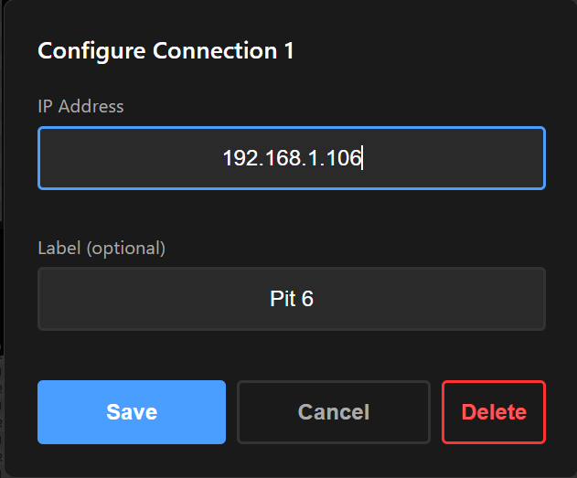
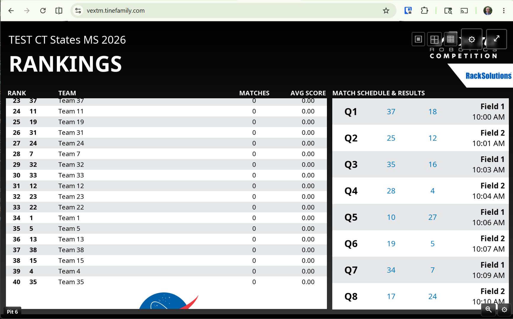
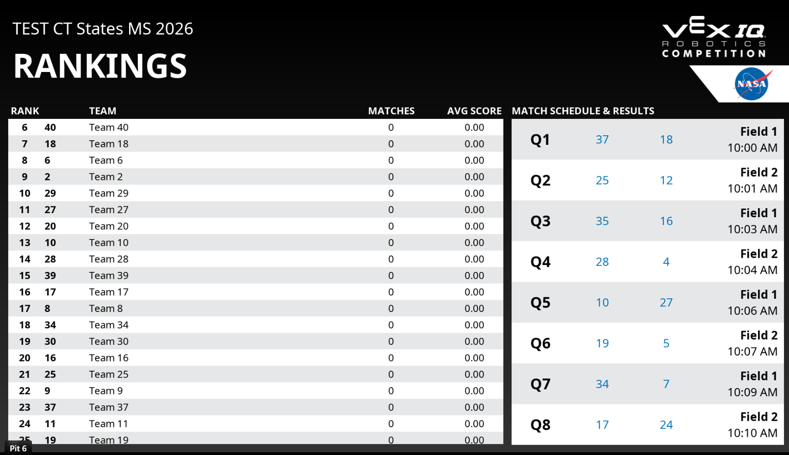
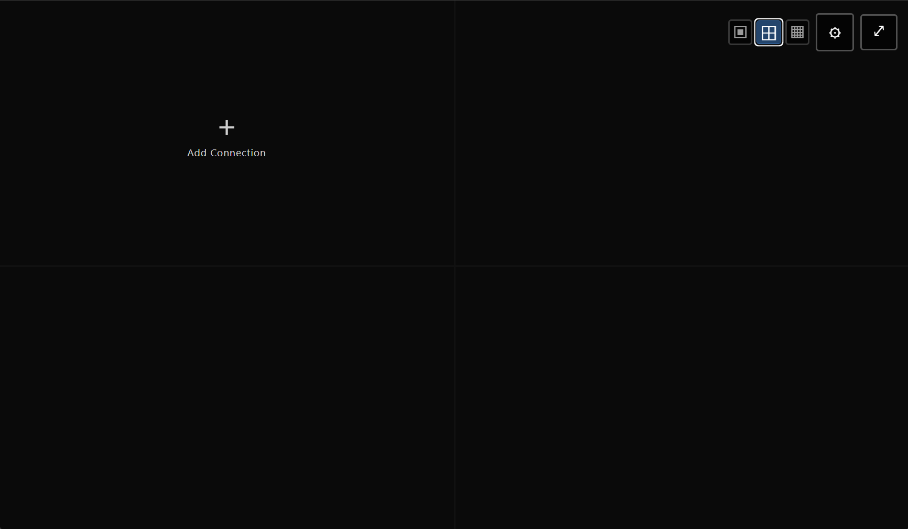
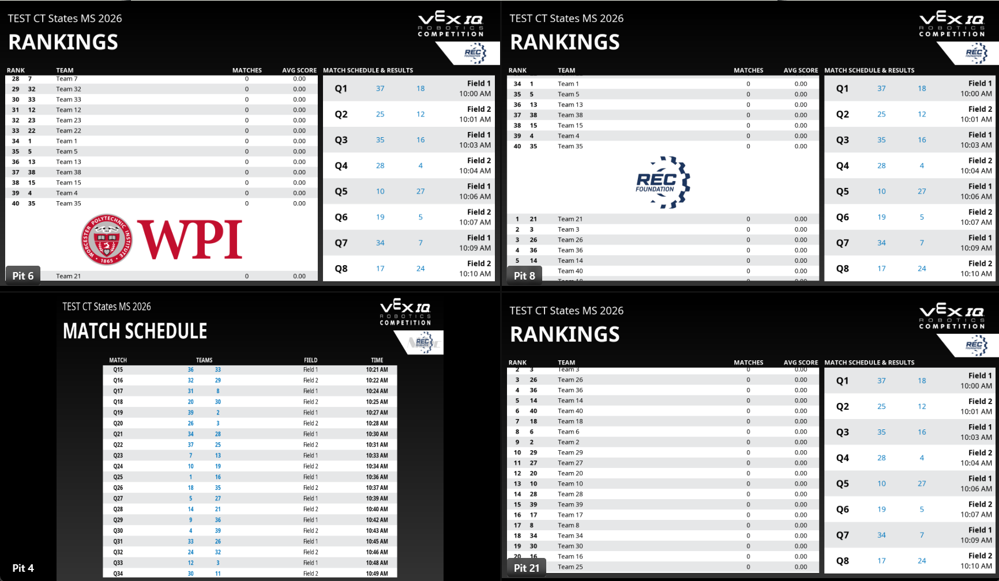
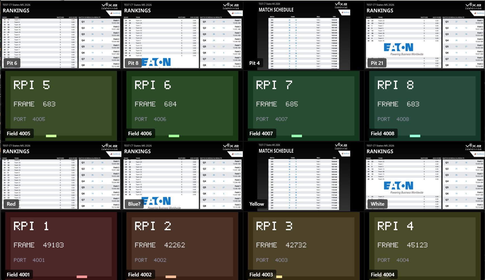
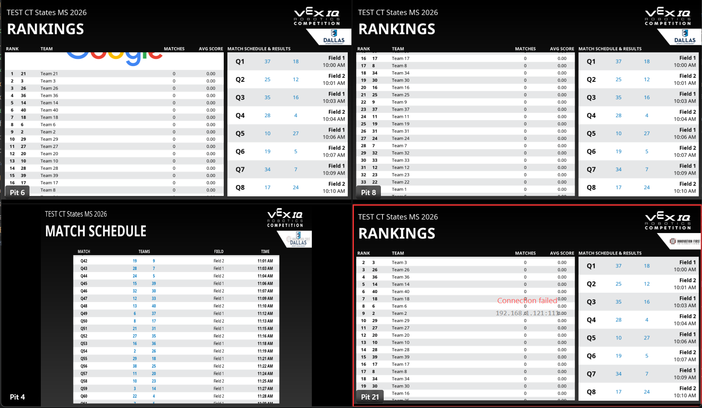
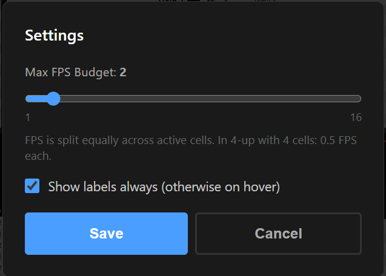

# VEX Tournament Manager Raspberry Pi Remote Display Client

The VEX Tournament Manager Raspberry Pi is a great tool to have pit displays located at any TV/projector in a VEX robotics competition venue. However, it's sometimes not feasible to get an HDMI connection to a TV, but the TV may be capable of displaying a full-screen view from a web browser (like via an attached computer, smartboard or remote projection software).

This project provides a static web page using ReactJS that connects to one or more VEX TM Raspberry Pis and continuously fetches and displays their screens via the Raspberry Pi's `http://<RPi IP>/screen.png` endpoint.  This has two primary uses:
1. Display a single Raspberry Pi as a remote display using a web browser
2. Remotely monitor up to 16 RPis simultaneously in a configurable grid layout.

## Hosted Page

This remote display page can be accessed via this repository's GitHub Site at <https://vextm.tinefamily.com> (or <https://steventine.github.io/vex-tm-rpi-web>).

**NOTE:** This is a static web page that has no backend/server component.  Once the page is loaded in the browser, you don't even need an Internet connection to make it work...all the network traffic to the Raspberry Pi stays local to your venue/network.

To directly display a single RPi without any configuration, add its IP address as a query parameter:
`https://vextm.tinefamily.com/?ip=192.168.1.121`

## Features

- **Multiple layout modes** — 1-up, 2×2 (4-up), and 4×4 (16-up) grid views
- **Up to 16 simultaneous RPi connections**, each independently polled
- **Per-cell configuration** — set an IP address and optional label for each cell
- **Zoom** — click any cell in a grid view to expand it to full screen; click a layout button to return
- **FPS budget** — configurable global FPS cap (1–16 FPS) split equally across active cells; e.g. 4-up with 4 cells uses 4 FPS each at a 16 FPS budget
- **Labels** — optional name per cell, shown always or only on hover (configurable)
- **Single RPi Mode** — loading the page with `?ip=<address>` opens a session-only single-cell view without affecting saved configuration
- **Persistent configuration** — layout, IP addresses, labels, and settings are all saved to browser local storage and restored on page refresh
- **Full-screen mode** — available at any time regardless of layout
- **Health indicator** — configured cells with connection errors show a red outline
- **Automatic reconnection** — cells retry on error without user intervention

# Screenshots

## Single Pi Remote Viewer Scenario

This scenario is generally used to display a single Raspberry Pi remotely in a web browser when it's not feasible to connect the Pi to the HDMI of the TV/projector.

**Full-disclosure**: This method of displaying the view from a Raspberry Pi is super simple (no software to install, no special hardware, etc) however it is not really optimized.  The image updates at about 1 frame-per-second (FPS) and takes about 2 Mbps of network bandwidth.  It's definitely better than nothing, but it's not super smooth.  I'm working on a [vex-tm-remote-display](https://github.com/steventine/vex-tm-remote-display) project to be more optimal, but it will also be more complex.

### Connection Configuration Screen


*The initial screen where users enter the IP address of their VEX TM Raspberry Pi*

### Display Screen

*The main display showing the VEX TM screen with controls visible (fullscreen button, configuration button, and layout controls)*

### Full Screen Mode

*The application in browser full-screen mode for maximum display area*

## Multi-Pi Remote Monitor Scenario

This scenario is generally used to remotely monitor a number of Raspberry Pis that are located throughout a facility.

### Empty Viewers


*Initial view lets you put remote Raspberry Pis into the desired location in the grid*

### Configure A Viewer


*Configuring the connection to a Raspberry Pi*

### 4-up View


*2x2 view*

### 16-up View


*4x4 view (I don't have 16 Raspberry Pis, so some in the view are simulated)*

### Unable To Reach a Pi


*Example of a single Raspberry Pi being unreachable*

### Page Configuration Screen


*Screen where users configure the behavior of the page*


# Requirements

- Modern web browser (Chrome or Edge recommended) with JavaScript enabled
- Network access to the VEX TM Raspberry Pi(s)
- The browser must be on the same network as the Raspberry Pi(s)

## Usage

### Layout Selection

Use the layout buttons in the top-right controls overlay to switch between views:

| Button | Layout | Cells |
|--------|--------|-------|
| ▣ | 1-up | 1 cell (slot 1) |
| ⊞ | 2×2 | 4 cells (slots 1–4) |
| ⊟ | 4×4 | 16 cells (slots 1–16) |

The selected layout is saved and restored on page refresh.

### Configuring Cells

Hover over any cell to reveal its controls:

- **Unconfigured cell** — shows a **+** prompt; click to add a connection
- **Configured cell** — shows a **⚙** gear icon; click to edit the IP address, label, or delete the connection

Each cell's configuration dialog has:
- **IP Address** — the address of the RPi (e.g. `192.168.1.100`)
- **Label** — optional display name (e.g. "Field 1")
- **Delete** — removes the connection and returns the cell to unconfigured state

### Zooming In

In 2×2 or 4×4 layout, click any configured cell to zoom it to a full-size view. That cell receives the full FPS budget while zoomed. Click any layout button to return to the grid.

### Global Settings

Click the **⚙** button in the top-right controls to open the settings panel:

- **Max FPS Budget** — total frames per second shared across all active cells (1–16, default 10). The budget is divided equally: 4-up with 4 cells = 4 FPS each at a 16 FPS budget; 16-up with 16 cells = 1 FPS each.
- **Show labels always** — when enabled, cell labels are always visible; when disabled, labels appear only on hover

### Single RPi Mode

Loading the page with a `?ip=` query parameter (e.g. `https://vextm.tinefamily.com/?ip=192.168.1.100`) opens a temporary single-cell view for that RPi. This mode:
- Does not read or modify any saved cell configuration
- Shows an **✕ Exit Single RPi Mode** button in the top-right to return to the normal layout

This is useful for sharing a direct link to a specific RPi with someone who doesn't need the full dashboard.

---

## Local Development

If interesetd in making improvements to this page/project, you'll need:
- Node.js (version 16 or higher recommended)
- npm package manager

## Installation

1. Clone or download this repository
2. Install dependencies:
   ```bash
   npm install
   ```

To run the development server:

```bash
npm run dev
```

The application will be available at `http://localhost:5173`.

### RPi Simulator

For local development and testing without physical hardware, a built-in simulator can stand in for up to 16 RPis:

```bash
# Start all 16 simulators (ports 4001–4016)
npm run sim

# Start just 4 simulators (ports 4001–4004)
npm run sim:4

# Start any number
node scripts/sim.js 8
```

Each simulator serves a dynamically generated PNG at `/screen.png` showing a distinct background color, the slot number, an incrementing frame counter, and a moving progress bar — making it easy to verify FPS budgeting and layout behavior visually.

Configure cells in the app using addresses like `localhost:4001`, `localhost:4002`, etc.

## Building for Production

```bash
npm run build
```

This creates a `dist` folder with all static files ready for deployment.

```bash
npm run preview   # preview the production build locally
```

## Configuration Reference

| localStorage key | Description | Default |
|---|---|---|
| `vex-layout` | Active layout (`'1'`, `'4'`, or `'16'`) | `'1'` |
| `vex-slots` | JSON array of 16 slot configs (`{ip, label}` or `null`) | all null |
| `vex-fps` | Global FPS budget (1–16) | `10` |
| `vex-show-labels` | Show labels always (`true`/`false`) | `false` |

## Deployment

After building with `npm run build`, the `dist` folder contains all static files deployable to any web host.

### GitHub Pages

This repository includes a GitHub Actions workflow that automatically builds and deploys to GitHub Pages on every push to `main`.

**Setup:**
1. Push this repository to GitHub
2. Go to **Settings** → **Pages** → set Source to **GitHub Actions**
3. The site will be available at `https://<username>.github.io/<repository-name>/`

**Manual trigger:** Go to the **Actions** tab → **Deploy to GitHub Pages** → **Run workflow**

### Other Hosting Options

The `dist` folder can be deployed to AWS S3, Netlify, Vercel, or any static file host.

---

NOTE: This application was created primarily with help from [Claude Code](https://claude.ai/claude-code).
